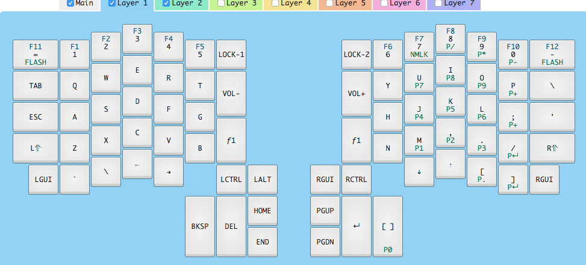

This is my Infitinty ErgoDox, based on the layout for the Kinesis Advantage.

https://input.club/configurator-ergodox/

Flash by putting the keyboard in flash mode and issuing the following command:
```
dfu-util -D
~/Downloads/MDErgo1-Default-a5627205d4c28ff3286702b1a6b06c54/left_kiibohd.dfu.bin
```

